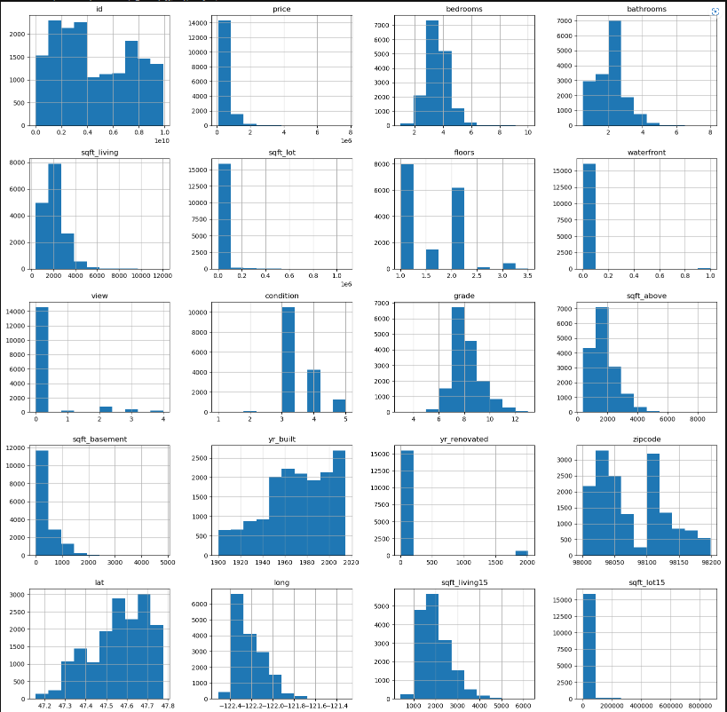
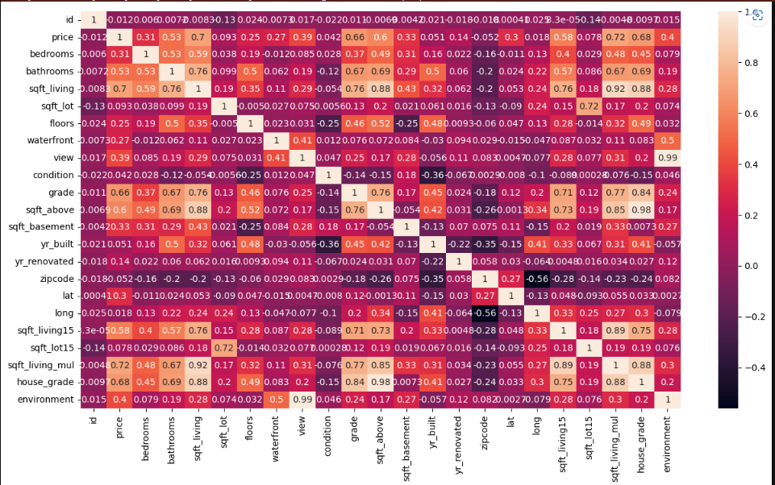
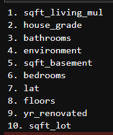
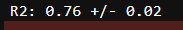
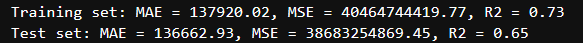
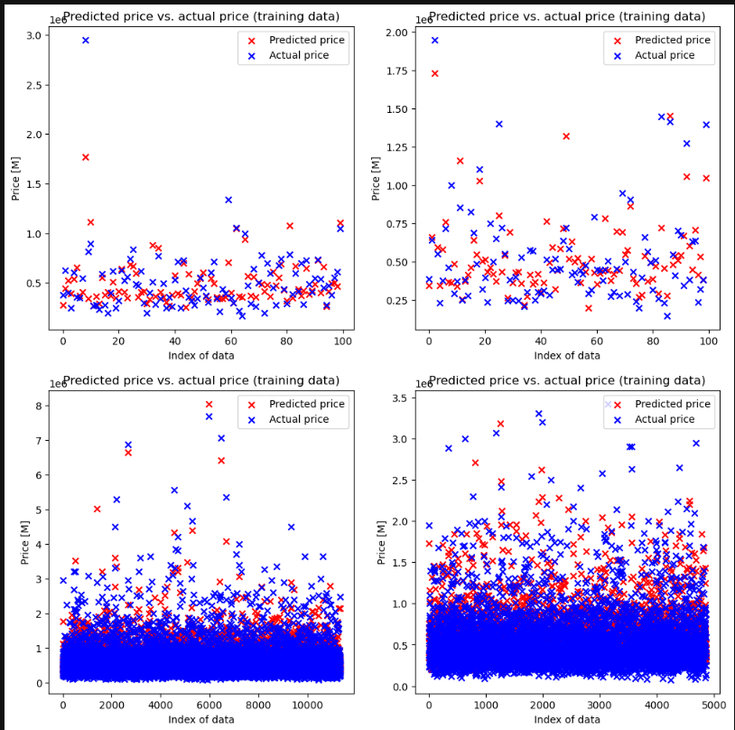

# Machine Learning Project - 4th year 2nd semester
House Price Prediction using Machine Learning
Objective
The goal of this project is to predict the sale prices of houses using various machine learning techniques such as linear regression, polynomial regression, Lasso, and Ridge.

Dataset
The dataset used for this project consists of information about houses such as square footage, number of bedrooms, location and their sale prices. The dataset is collected from various sources and cleaned for missing values.
## **Data Visualization**



## **Data Correlation**



## **Data Preprocessing**

```
df1["sqft_living_mul"] = df1["sqft_living"] * df1["sqft_living15"]
```

Result in higher correlation (0.72) from .7 and .58

```
df1["house_grade"] = df1["sqft_above"] * df1["grade"]
```

Result in higher correlation (0.68) from .66 and .6

```
df1["environment"] = df1["view"] + df1["waterfront"]
```

Result in higher correlation (0.4) from .39 and .27

<i>**Note:**</i> The heatmap above already showed the correlation of theses new features.

## **Top 10 relevant Features**



## **Selected Features**

```
X = df1[['sqft_living_mul', 'house_grade', 'bathrooms', 'environment', 'sqft_basement', 'bedrooms', 'lat']] 
y = df1['price']
```

## **Pipeline**

```

pipeline = Pipeline([
    ("imp_mean", SimpleImputer()),
    ('scaler', StandardScaler()),
    ('poly', PolynomialFeatures(degree=3)),
    ('lasso', Lasso(alpha=1, max_iter=10000, tol=1e-6))
])

```

## **Result testing by k-fold cross-validation**

```
kfold = KFold(n_splits=10, shuffle=True, random_state=42) 
scores = cross_val_score(pipeline, X, y, cv=kfold, scoring='r2') 
mean_score = scores.mean() 
std_score = scores.std()

avg_error = std_score / np.sqrt(kfold.n_splits)

print(f'R2: {mean_score:.2f} +/- {avg_error:.2f}')
```



## **Result testing by train test split**

```

test_size = 0.3

```



### Graph showing result with 100 samples for row 1 and all samples for row 2



## **Download model**

[best_model.pkl](./best_model.pkl)
