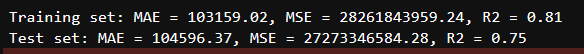
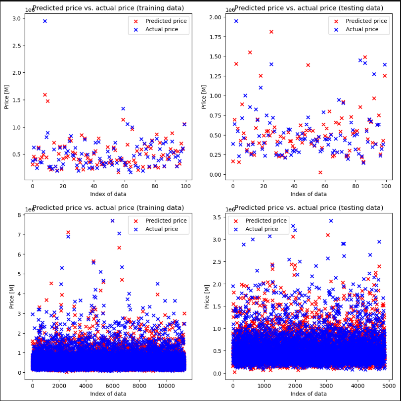

## **Top 5 relevant Features**


## **Selected Features**

```
X = df1[['sqft_living', 'grade', 'sqft_above', 'sqft_living15']]
y = df1['price']
```

## **Pipeline**

```
pipeline = Pipeline([
    # ('scaler', StandardScaler()),
    ('poly', PolynomialFeatures(degree=5)),
    ('model', Lasso(alpha=0.1, max_iter=10000)) # version 1.2
    # ('model', Lasso(alpha=0.1, max_iter=10000, normalize=True)) #version <= 1.0
])
```

Note: I think not using the scaler give a better result in this case.

## **Result testing by train test split**

```
test_size = 0.3
```



### Graph showing result with 100 samples for row 1 and all samples for row 2



## **Result testing by k-fold cross-validation**


## **Download model**

[best_model.pkl](./best_model.pkl)
